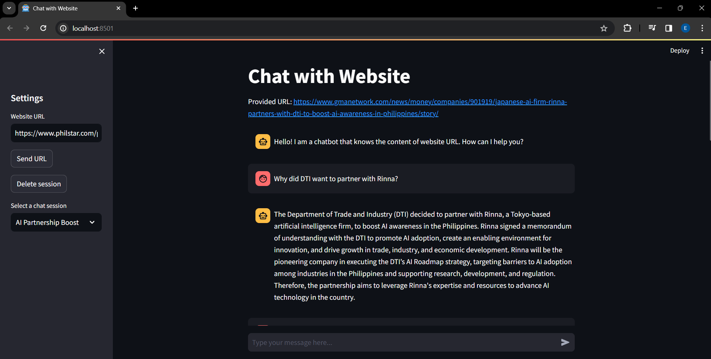

# 🌐 Chat with Website

This project creates a chatbot that can answer questions related to the content of provided website URL. The chatbot has the following features:
- Persistent memory to not forget the chat session history with help of Retrieval Augmented Generation (RAG)
- Saves, loads, and deletes past chat sessions 
- Answers questions outside but related to the Website content (with knowledge base of information trained on GPT-3.5)

**Web Application preview:**
<p align="center">
  
</p>


## Installations

- Clone the repository by ```git clone https://github.com/ejcrusina/Chat-with-Website.git```
- Install [Python 3.11](https://www.python.org/downloads/release/python-3113/)
- ```Makefile``` can be used on the go in Linux/Mac OS. However, in Windows, you may need to install a package manager like [WinGet](https://learn.microsoft.com/en-us/windows/package-manager/winget/install) before using it.


## Usage

1. Create and activate the virtual environment along with installation of Python packages using ```make``` (or manually).
2. Inside the project root, run ```streamlit run src/app.py``` to start the web app.

## License
[MIT](https://choosealicense.com/licenses/mit/)
